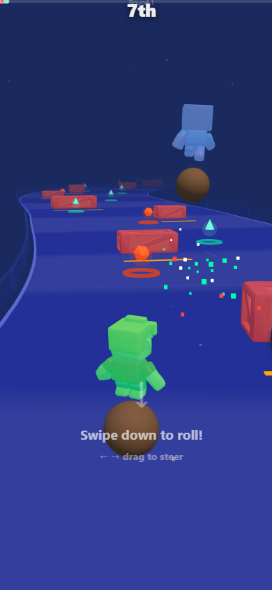

# Sky Roller

7-player ball race on a sky track — dodge crates, collect buffs, ragdoll on crash.

**[Play Now](https://ariescar0326-sketch.github.io/prototype002-skyroller/)**

## About

- Drag to steer your ball on a curved sky track, race against 6 AI opponents
- Hit an obstacle crate and your character ragdolls through the air with full physics
- Buff pads launch you airborne, dash lets you smash through obstacles, iron balls are invincible but slow

## How to Play

- **Swipe down** to roll forward (faster swipe = more speed)
- **Drag left/right** to steer
- Avoid red warning crates or get launched into the sky
- Green pads give you airborne buff with multi-bounce
- First to reach the finish line wins

## Design Notes

Ball size is the core trade-off: small balls are fast but one crate hit sends you flying, iron balls are invincible but crawl along. Every race the AI gets a random mix, so the dynamics change each round.

The ragdoll system uses cannon-es physics for the shattered body parts and a separate flying character that launches forward along the track. Watching 3 racers get wiped out by the same crate never gets old.

Buff pads were the last addition but became the highlight — getting launched into the sky and bouncing twice before landing gives a rollercoaster feeling that pure ground racing doesn't have.

## Dev Log

Built with Three.js + cannon-es, single HTML file. GLTF characters from Quaternius asset pack with skeletal Run/Death animations via AnimationMixer. The tricky part was SkeletonUtils.clone — regular Object3D.clone breaks SkinnedMesh bone bindings.

Seven racers running simultaneously with full physics is surprisingly smooth on mobile. The key was keeping collision shapes as simple spheres and boxes while the visual models do all the detailed work.

What do you think — should the iron ball be slower but completely invincible, or faster but only resistant?

## Credits

3D models by [@quaternius](https://quaternius.com/)

## Links

- Play: https://ariescar0326-sketch.github.io/prototype002-skyroller/
- Series: [@AriescarTu](https://linktr.ee/ariescar0326)
- More prototypes: [github.com/ariescar0326-sketch](https://github.com/ariescar0326-sketch)
