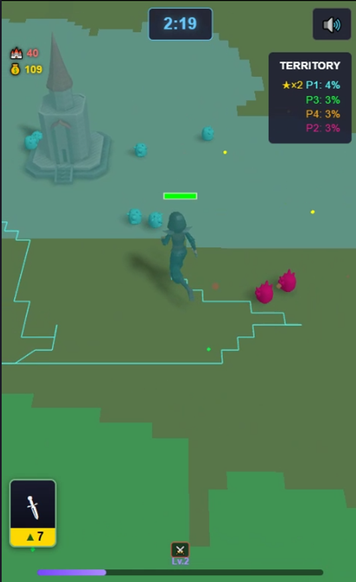

# Territory Conquest

**Prototype #006** — A paper.io-style 4-player territory conquest game built with Three.js.

## Play

[Play on GitHub Pages](https://ariescar0326-sketch.github.io/prototype006-territory/)

## About

Drag your hero to paint territory on a 200x200 grid. Close loops to claim land. Earn gold, level up, and unlock Attack-path skills (Blade Rush, Shotgun, Bomber). Last faction standing wins.

## Features

- 4-faction territory war on a 3D grid
- Drag to move, close loops to claim territory
- Roguelike skill upgrades (Attack path)
- GLTF character models with animations
- Procedural audio (23 sound types, no external files)
- Mobile-first portrait mode

## Tech

- Three.js r160+ (CDN import map)
- Single HTML file (~5200 lines)
- Web Audio API procedural synthesis
- Influence-map AI (50x50 grid)
- Incremental BFS flood fill

## Controls

- **Mobile**: Drag to move your hero
- **Desktop**: Click and drag

---

*Part of the Prototype Lab series — lightweight 3D browser games.*
